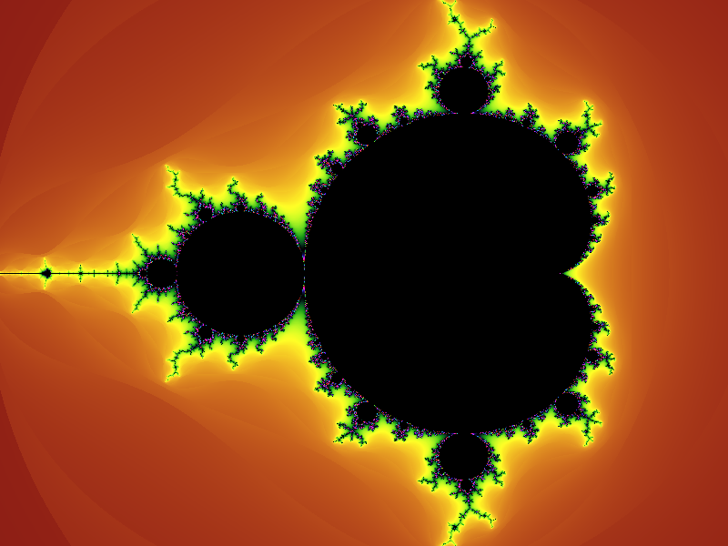
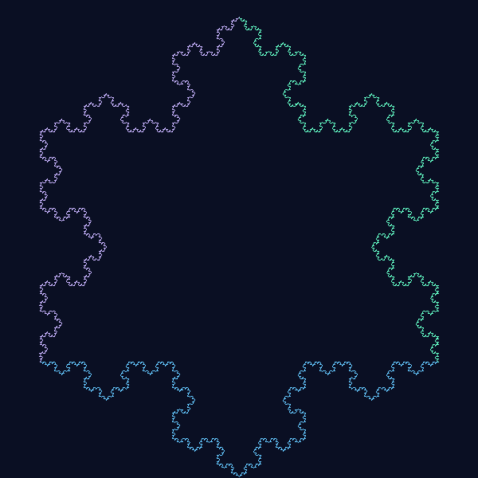
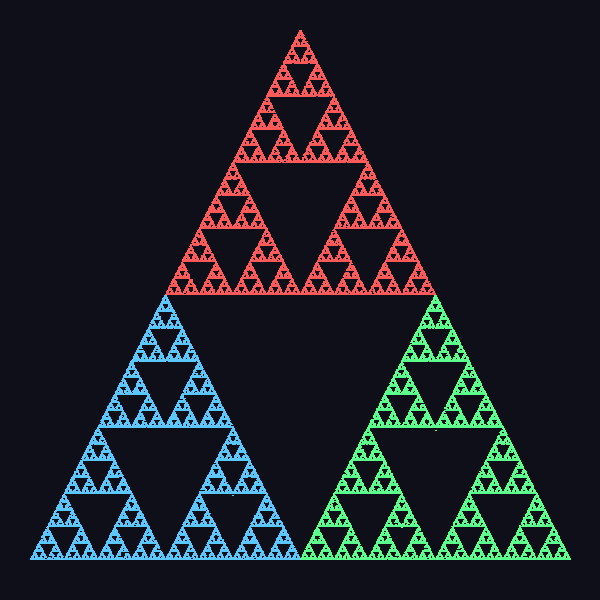
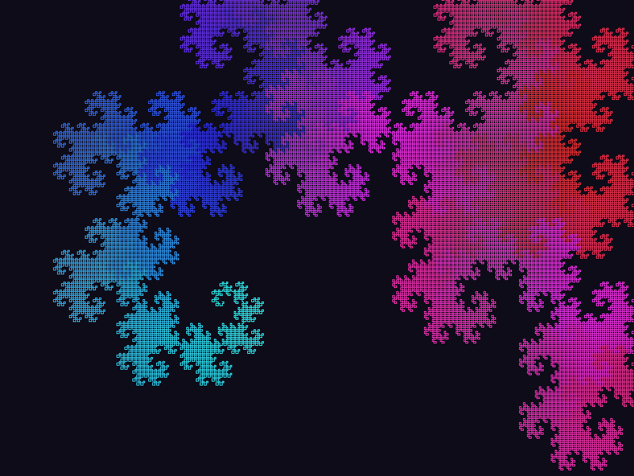
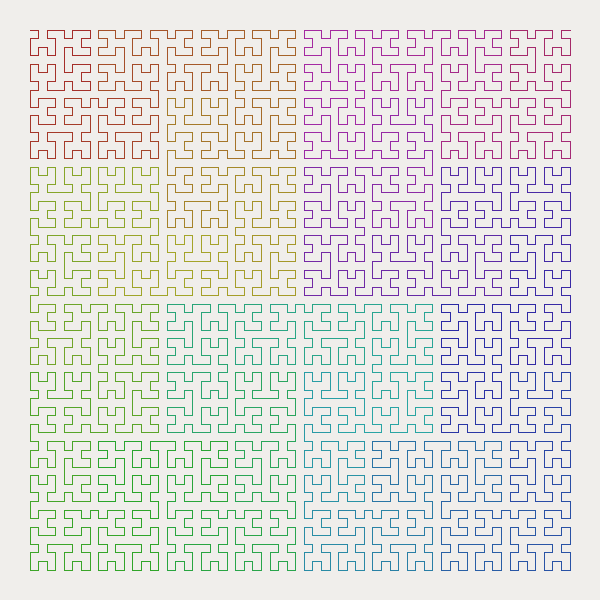
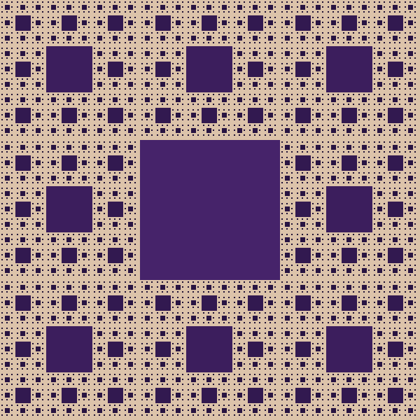
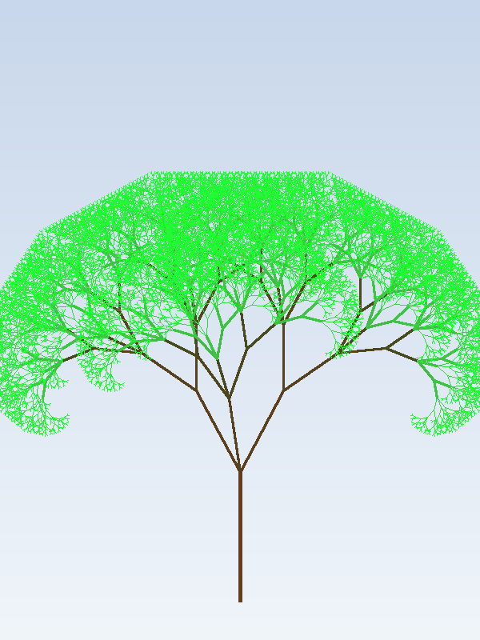
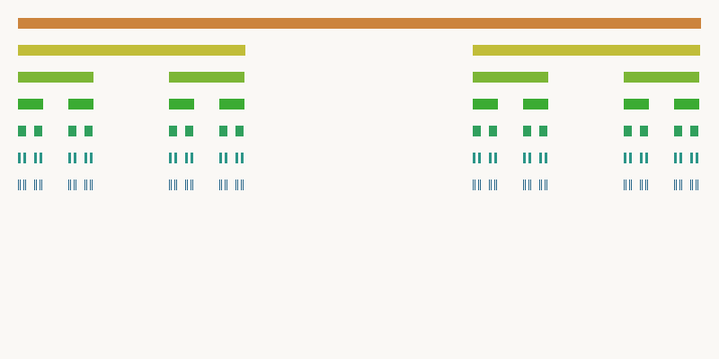

# Fractal

**Cross-platform fractal programs in C++**


## About

A collection of classic fractal and graphics programs implemented in C++. Originally built with [EasyX](https://easyx.cn) (Windows), now cross-platform via an SDL2 compatibility layer. Also compiles to WebAssembly via Emscripten for in-browser demos.

---

## Gallery

<table>
<tr>
  <td align="center"><br><b>Mandelbrot Set</b></td>
  <td align="center"><br><b>Barnsley Fern</b></td>
  <td align="center"><br><b>Koch Snowflake</b></td>
</tr>
<tr>
  <td align="center"><br><b>Sierpinski Triangle</b></td>
  <td align="center"><br><b>Dragon Curve</b></td>
  <td align="center"><br><b>Hilbert Curve</b></td>
</tr>
<tr>
  <td align="center"><br><b>Sierpinski Carpet</b></td>
  <td align="center"><br><b>Arborescent Tree</b></td>
  <td align="center"><br><b>Cantor Set</b></td>
</tr>
</table>

---

## Try in Browser

**Live demos** (after first gh-pages deploy): **[All demos + math gallery](https://xwhqsj.github.io/Fractal/)**. Static gallery above.

| Demo | Live Link |
|------|-----------|
| Mandelbrot (Interactive) | [Launch](https://xwhqsj.github.io/Fractal/mandelbrot_interactive.html) |
| Mandelbrot Set | [Launch](https://xwhqsj.github.io/Fractal/mandelbrot.html) |
| Barnsley Fern | [Launch](https://xwhqsj.github.io/Fractal/fern.html) |
| Dragon Curve | [Launch](https://xwhqsj.github.io/Fractal/dragon.html) |
| Hilbert Curve | [Launch](https://xwhqsj.github.io/Fractal/hilbert.html) |
| Koch Snowflake | [Launch](https://xwhqsj.github.io/Fractal/kochsnow.html) |
| Sierpinski Triangle | [Launch](https://xwhqsj.github.io/Fractal/sierpinski.html) |
| Sierpinski Carpet | [Launch](https://xwhqsj.github.io/Fractal/sierpinski_carpet.html) |
| Starfield | [Launch](https://xwhqsj.github.io/Fractal/stars.html) |

---

## Download Prebuilt Binaries

Prebuilt native binaries for Linux (x86_64) and macOS (ARM64) are available on the [Releases](https://github.com/XWHQSJ/Fractal/releases) page. Tag a version (`git tag v1.0.0 && git push --tags`) to trigger a release build.

---

## Gallery

| Fractal / Demo | Source | Description |
|---|---|---|
| Sierpinski Triangle | [`sierpinski/sierpinski.cpp`](sierpinski/sierpinski.cpp) | Chaos-game Sierpinski triangle |
| Sierpinski Carpet | [`sierpinski/sierpinskiCarpet.cpp`](sierpinski/sierpinskiCarpet.cpp) | Recursive carpet fractal |
| Cantor Set | [`cantor/cantor.cpp`](cantor/cantor.cpp) | Cantor set line fractal |
| Koch Snowflake (EasyX) | [`kochsnow/kochsnowByEasyX.cpp`](kochsnow/kochsnowByEasyX.cpp) | Koch snowflake |
| Koch Snowflake (ASCII) | [`kochsnow/kochsnowByASCII.cpp`](kochsnow/kochsnowByASCII.cpp) | Koch snowflake as ASCII art |
| Arborescent Tree | [`arboresent/arboresent/arboresent.cpp`](arboresent/arboresent/arboresent.cpp) | Recursive branching tree with depth-gradient coloring |
| Triangle | [`triangle/triangle.cpp`](triangle/triangle.cpp) | Triangle drawing demo |
| Stars | [`stars/stars.cpp`](stars/stars.cpp) | Starfield visual effect |
| Rainbow | [`rainbow/rainbow.cpp`](rainbow/rainbow.cpp) | Rainbow arc rendering |
| Mouse / Cursor Effect | [`mouse/mouse.cpp`](mouse/mouse.cpp) | Mouse-driven cursor visual effect |

### New Fractals

| Fractal | Source | Description |
|---|---|---|
| Mandelbrot Set | [`mandelbrot/mandelbrot.cpp`](mandelbrot/mandelbrot.cpp) | Escape-time Mandelbrot with 256-color rainbow palette |
| Interactive Mandelbrot | [`mandelbrot/interactive.cpp`](mandelbrot/interactive.cpp) | Click-to-zoom Mandelbrot explorer (press R to reset) |
| Barnsley Fern | [`fern/fern.cpp`](fern/fern.cpp) | 4 weighted affine transforms, 200k iterations |
| Dragon Curve | [`dragon/dragon.cpp`](dragon/dragon.cpp) | Recursive paper-folding curve |
| Hilbert Curve | [`hilbert/hilbert.cpp`](hilbert/hilbert.cpp) | Order-5 space-filling curve |
| L-System Interpreter | [`lsystem/demo.cpp`](lsystem/demo.cpp) | General L-system engine with Koch, Dragon, Plant demos |

**[HTML Gallery with math formulas](docs/index.html)**

---

## Note on Mario2

The [`Mario2/`](Mario2/) directory contains a separate small Mario-style platformer game built with EasyX. It is **not a fractal program** but is included as bonus content.

---

## Cross-Platform Build

### Prerequisites

| Platform | Install SDL2 |
|----------|-------------|
| macOS | `brew install sdl2` |
| Ubuntu/Debian | `sudo apt install libsdl2-dev` |
| Fedora | `sudo dnf install SDL2-devel` |
| Windows | Use native EasyX, or install SDL2 and pass `-DEASYX_COMPAT_USE_SDL=ON` |

### Build

```bash
brew install sdl2          # macOS
cmake -B build -S .
cmake --build build
```

### Tests

```bash
ctest --test-dir build --output-on-failure
```

10 unit tests covering Koch midpoint math, Mandelbrot escape counts, Sierpinski convergence, and L-system rule expansion.

### WebAssembly Build (Emscripten)

```bash
# Install Emscripten SDK (if not already)
# See https://emscripten.org/docs/getting_started/downloads.html

emcmake cmake -B build-web -S . -DEASYX_COMPAT_USE_SDL=ON
emmake cmake --build build-web -j
# Each demo produces a .html + .js + .wasm triplet in build-web/
```

The GitHub Pages deployment happens automatically on push to `master` via the `gh-pages` workflow.

---

## Architecture

- **`easyx_compat.h`** -- Single-header SDL2 shim implementing the EasyX API subset used by all demos. On Windows with real EasyX installed, it's a no-op.
- **`fractal_common.h`** -- Shared boilerplate: RNG init, random/palette color helpers, standard window dimensions.
- **`lsystem/lsystem.h`** -- Reusable L-system interpreter with turtle graphics renderer.
- **`CMakeLists.txt`** -- Top-level build with per-demo targets and GoogleTest integration.

## References

- [EasyX Graphics Library (Official Site)](https://easyx.cn)
- [SDL2 Wiki](https://wiki.libsdl.org/)

## License

[MIT](LICENSE) -- Copyright (c) 2019 XWHQSJ
